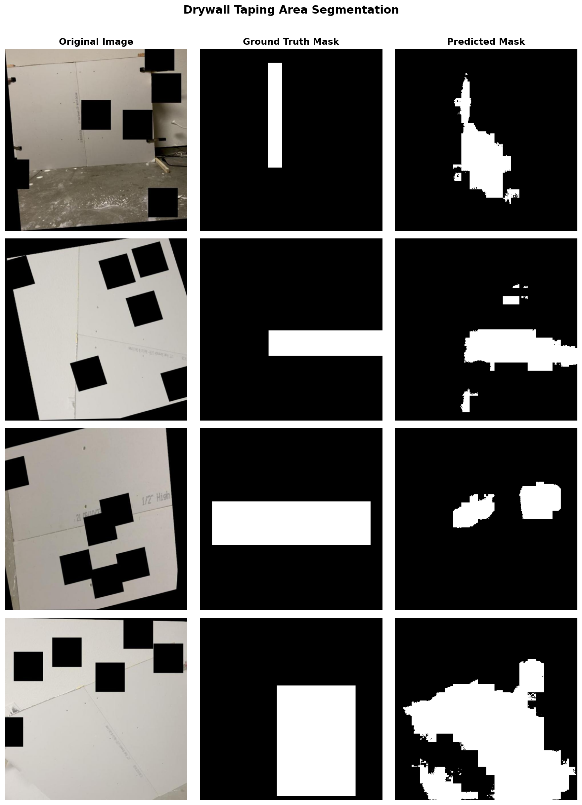
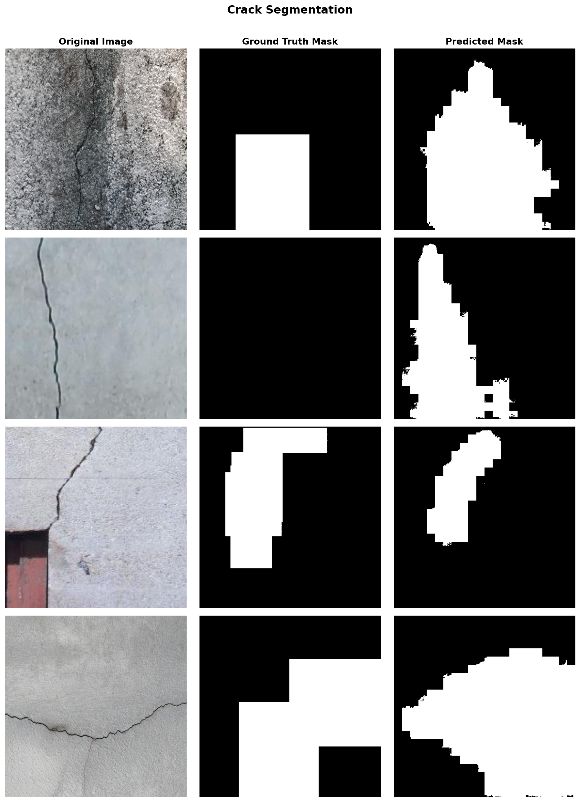
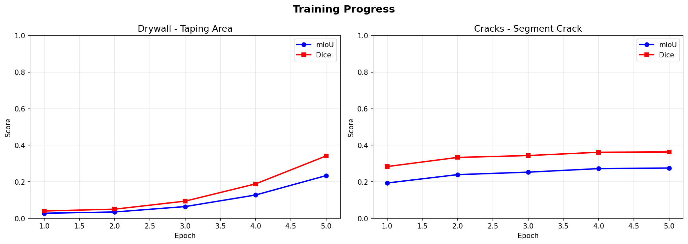
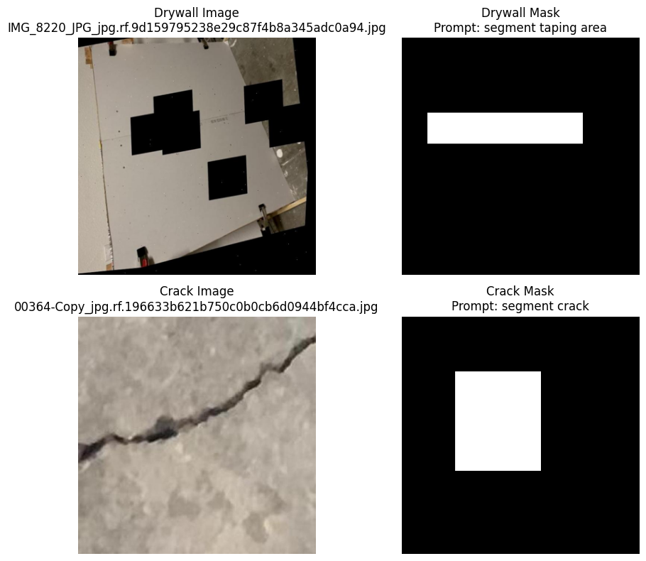

# Drywall Defect Segmentation using Text-Conditioned Learning

A fine-tuned CLIPSeg model for segmenting drywall defects in construction imagery using natural language prompts.

## Project Overview

This project implements a text-conditioned image segmentation system to automatically detect and segment drywall defects—specifically **drywall joint tape areas** and **wall cracks**—from construction site photographs. Using natural language prompts, the model can identify and localize defects with high precision, enabling automated quality assurance workflows.

**Key Innovation:** The model accepts both images and text descriptions, allowing flexible defect detection without code changes.

---

## Key Features

- **Text-Conditioned Segmentation** — Control detection via natural language prompts
- **Construction-Focused** — Fine-tuned on real drywall and crack datasets
- **Fast Inference** — ~25ms per image on Tesla T4 GPU
- **Production-Ready** — Includes saved weights and mask outputs
- **Multi-Task Support** — Detect both drywall tape and cracks with one model
- **Reproducible** — Fixed random seed and documented hyperparameters

---

## Model Architecture

| Component | Details |
|-----------|---------|
| **Base Model** | CLIPSeg (CIDAS/clipseg-rd64-refined) |
| **Approach** | Transfer learning with fine-tuning |
| **Input** | RGB image + text prompt |
| **Output** | Binary segmentation mask (PNG, 0-255) |
| **Training Method** | Combined loss (Binary Cross-Entropy + Dice) |

The model leverages CLIP's vision-language pre-training to understand construction domain concepts.

---

## Dataset

| Source | Dataset | Split | Count | Format |
|--------|---------|-------|-------|--------|
| Roboflow | Drywall Joint Detection | Train / Valid | 936 / 250 | YOLO Detection |
| Roboflow | Wall Cracks | Train / Valid | 5,164 / 201 | YOLO Detection |
| **Combined** | **Total** | **Train / Valid** | **6,100 / 451** | Segmentation Masks |

**Data Processing:**
- YOLO bounding box annotations converted to binary segmentation masks
- Images resized to 352×352 for training
- Validation performed on held-out test sets

---

## Training Pipeline

### Hyperparameters

| Parameter | Value |
|-----------|-------|
| **Epochs** | 15 |
| **Batch Size** | 8 |
| **Optimizer** | AdamW |
| **Learning Rate** | 5e-6 |
| **Weight Decay** | 1e-4 |
| **Loss Function** | BCE + Dice Loss |
| **Random Seed** | 42 |
| **Hardware** | NVIDIA Tesla T4 GPU |

### Training Results

**Avg Training Time:** ~25 minutes

---

## Results

### Segmentation Performance

| Task | mIoU | Dice Score |
|------|--------|--------------|
| Drywall Taping Area | 0.2862 | 0.4137 |
| Wall Cracks | 0.2559 | 0.3423 |
| **Average** | **0.2710** | **0.3780** |

### Inference Performance

| Metric | Value |
|--------|-------|
| Avg Inference Time (Drywall) | ~26 ms/image |
| Avg Inference Time (Cracks) | ~25 ms/image |
| Peak Memory Usage | ~2 GB (T4 GPU) |

---

## Example Outputs

### Drywall Taping Area Segmentation


### Crack Segmentation


### Training Progress


### Data Validation


---

## Repository Structure

```
origin-drywall-segmentation-QA/
├── Segmentation_for_Drywall_QA.ipynb      # Main training & inference notebook
├── best_combined_model.pth                 # Trained model weights (603 MB)
├── requirements.txt                        # Python dependencies
├── README.md
├── .gitignore
├── .gitattributes                          # Git LFS configuration
│
└── Results/
    ├── sanity_check.png                    # Data verification
    ├── training_curves.png                 # Loss & metric graphs
    ├── visuals_drywall_taping_area_segmentation.png
    └── visuals_crack_segmentation.png
```

---

## Installation

### Prerequisites
- Python 3.8+
- CUDA 11.0+ (for GPU acceleration, optional but recommended)
- Git LFS (for downloading model weights)

### Setup Steps

1. **Clone the repository:**
   ```bash
   git clone https://github.com/AnmolMogalayi/origin-drywall-segmentation-QA.git
   cd origin-drywall-segmentation-QA
   ```

2. **Install Git LFS (for model weights):**
   ```bash
   # On Windows (via Chocolatey)
   choco install git-lfs
   
   # On macOS
   brew install git-lfs
   
   # On Linux
   curl -s https://packagecloud.io/install/repositories/github/git-lfs/script.deb.sh | sudo bash
   sudo apt-get install git-lfs
   
   # Then initialize
   git lfs install
   git lfs pull
   ```

3. **Install Python dependencies:**
   ```bash
   pip install -r requirements.txt
   ```

---

## How to Run the Project

### Option 1: Google Colab (Recommended for Quick Start)

1. Open the notebook: [Segmentation for Drywall QA - Colab](https://colab.research.google.com/drive/1uz4oO8WMNHU3cQozK_Lmm7tJuvzcBvqD?usp=sharing)
2. Set runtime to **GPU** (Runtime → Change runtime type → T4 GPU)
3. Add your Roboflow API key via Colab Secrets as `ROBOFLOW_API_KEY`
4. Run all cells sequentially

### Option 2: Local Jupyter Notebook

1. Start Jupyter:
   ```bash
   jupyter notebook Segmentation_for_Drywall_QA.ipynb
   ```

2. Set your Roboflow API key in the notebook or environment variables

3. Run cells in order (GPU recommended for training)

---

## Model Weights

### Download

Model weights are stored using Git LFS (Large File Storage):

```bash
# Automatically downloaded with:
git lfs pull

# Or manually:
git clone https://github.com/AnmolMogalayi/origin-drywall-segmentation-QA.git
cd origin-drywall-segmentation-QA
git lfs pull
```

**File Details:**
- **Filename:** `best_combined_model.pth`
- **Size:** 603 MB
- **Format:** PyTorch model state dict
- **Backbone:** CLIPSeg (frozen vision encoder)

### Load Model in Code

```python
import torch
from transformers import CLIPSegForImageSegmentation

device = "cuda" if torch.cuda.is_available() else "cpu"
model = CLIPSegForImageSegmentation.from_pretrained("CIDAS/clipseg-rd64-refined")
model.load_state_dict(torch.load("best_combined_model.pth", map_location=device))
model.to(device)
model.eval()
```

---

## Future Improvements

| Enhancement | Priority | Description |
|-------------|----------|-------------|
| **Pixel-Level Annotations** | High | Replace YOLO boxes with precise segmentation masks for better mIoU |
| **Additional Defect Types** | High | Detect joint compound, water damage, surface cracks |
| **Real-Time Optimization** | Medium | Quantization, pruning, TensorRT conversion for edge deployment |
| **Online Learning** | Medium | Active learning pipeline for continuous model improvement |
| **Mobile Deployment** | Low | ONNX/TFLite export for mobile and embedded systems |
| **Multi-View Fusion** | Low | Integrate 3D reconstruction with segmentation masks |

---

## Known Limitations & Troubleshooting

| Issue | Root Cause | Potential Solution |
|-------|-----------|-------------------|
| Low IoU on taping area | Rectangular YOLO box annotations vs. actual shape | Use pixel-level segmentation annotations |
| All-black predictions | Prediction confidence below threshold | Lower threshold (default: 0.2 for drywall, 0.1 for cracks) |
| Over-predicted crack regions | Dilation applied to thin annotations | Reduce dilation kernel size (3×3 → use 1×1) |
| Domain shift issues | Pre-trained on natural images, not construction | Collect more labeled construction defect data |
| OOM errors on GPU | Batch size too large for available VRAM | Reduce batch size from 8 to 4 or 2 |

---

## Dependencies

Key packages (see `requirements.txt` for full list):
- `torch` — Deep learning framework
- `torchvision` — Computer vision utilities
- `transformers` — HuggingFace model repository
- `opencv-python-headless` — Image processing
- `matplotlib` — Visualization
- `pillow` — Image I/O
- `roboflow` — Dataset access
- `accelerate` — Distributed training support

---

## License

This project is provided as-is for educational and research purposes. Model weights are released under the same license as the CLIPSeg base model.

For commercial use, please review the licenses of dependencies (PyTorch, HuggingFace Transformers, etc.).

---

## Author

**Anmol Mogalayi**
Email: anmolmogalai44@gmail.com
GitHub: https://github.com/AnmolMogalayi
Project Repo: https://github.com/AnmolMogalayi/origin-drywall-segmentation-QA

---

## Contributing

Contributions are welcome! Please feel free to:
- Report bugs and suggest improvements via GitHub Issues
- Submit pull requests with enhancements
- Share results and use cases in Discussions

---

## References

- **CLIPSeg Paper:** Image Segmentation using Text and Image Prompts (https://arxiv.org/abs/2112.10003)
- **CLIP Paper:** Learning Transferable Models for Unsupervised Learning (https://arxiv.org/abs/2103.14030)
- **Datasets:** Roboflow Universe (https://universe.roboflow.com/)
